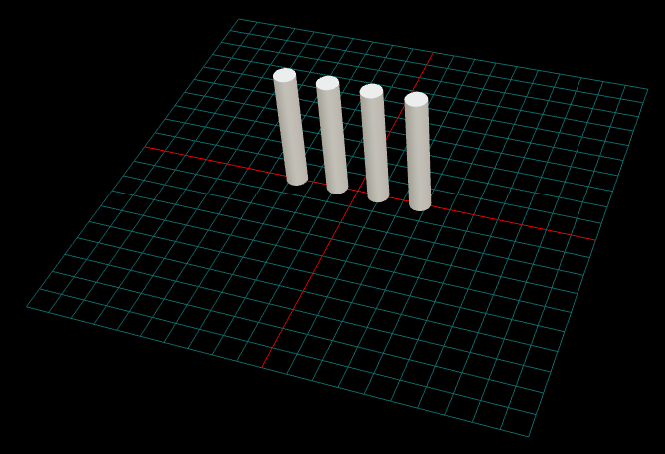
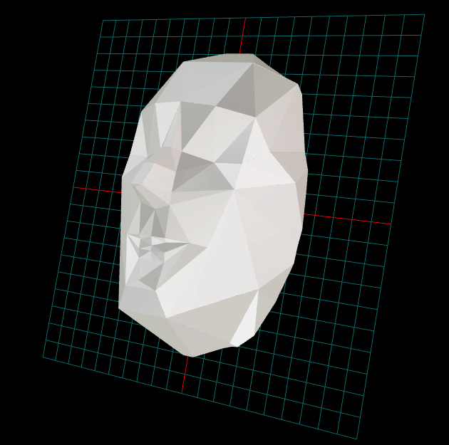
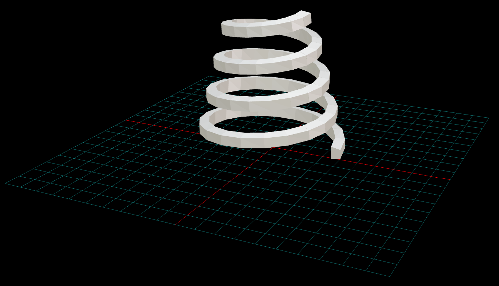
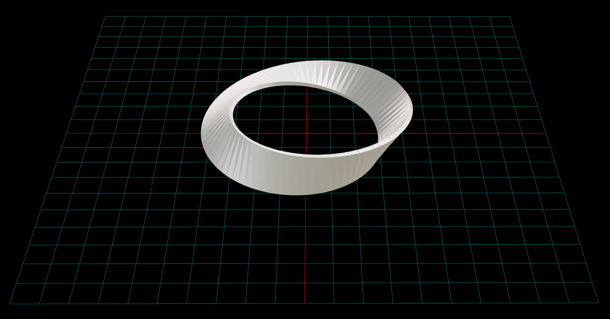

# Examples Directory

This directory contains examples demonstrating the capabilities of shellforgepy for creating 3D printable geometries. Each example includes working code and generates STL files ready for 3D printing.

## Available Examples

### 1. Filleted Box Variations (`filleted_boxes_example.py`)

Demonstrates the `create_filleted_box` functionality with different fillet configurations.

**Features**:
- Parametric filleted box creation
- Selective edge filleting
- Production-ready part arrangement
- Automatic build plate layout

**Output**: 12 different filleted box STL files arranged for 3D printing

---

### 2. Basic Cylinder Generation (`create_cylinder_stl.py`)

Demonstrates point cloud to mesh workflow for cylindrical shapes.

**Features**:
- Point cloud generation for cylinders
- Mesh triangulation and partitioning
- Multi-object positioning
- STL export

**Output**: `cylinder_mesh.stl` - Array of 4 cylinders



---

### 3. 3D Face Mesh Creation (`create_face_stl.py`)

Creates complex organic shapes with mesh partitioning for multi-part printing.

**Features**:
- Organic shape point cloud generation
- Mesh partitioning (front/back, upper/lower)
- Shell creation for hollow parts
- Multiple STL outputs for different regions

**Output**: Multiple STL files (face_m_front.stl, face_m_back.stl, etc.)



---

### 4. Trapezoidal Snake Geometry (`create_trapezoidal_snake_stl.py`)

Creates geometries that follow 3D paths with consistent cross-sections.

Creates geometries that follow 3D paths with consistent cross-sections.

**Features**:
- Straight channels with trapezoidal cross-sections
- Curved paths following mathematical functions
- Helical coils with configurable radii
- Conical coils with tapering geometry
- Möbius strips with one-sided topology

**Capabilities**:
- Coordinate transformation for path following
- Custom normal directions
- Loop closure with vertex correspondence detection
- Cross-section orientation control

**Output**: Five STL files:
- `straight_snake.stl` - 50mm trapezoidal channel
- `curved_snake.stl` - 100mm sine wave path
- `cylindrical_coil.stl` - 3-turn helical coil
- `conical_coil.stl` - Tapering coil (40mm→20mm radius)
- `mobius_strip.stl` - One-sided mathematical surface



**Möbius Strip**: 
Creates a one-sided surface that twists 180° over one revolution and closes without gaps.



**Applications**:
- LED strip channels and mounting systems
- Cable management and wire routing  
- Decorative moldings and trim pieces
- Custom coils and spiral structures
- Mathematical models and educational demonstrations

## Getting Started

### Running the Examples

Each example can be run independently:

```bash
python3 examples/filleted_boxes_example.py
python3 examples/create_cylinder_stl.py
python3 examples/create_face_stl.py
python3 examples/create_trapezoidal_snake_stl.py
```

### Output Location

All examples create STL files in the `output/` directory:
```
output/
├── cylinder_mesh.stl
├── face_m_front.stl
├── face_m_back.stl
├── face_m_upper.stl
├── face_m_lower.stl
├── face_m_complete.stl
├── straight_snake.stl
├── curved_snake.stl
├── cylindrical_coil.stl
├── conical_coil.stl
└── mobius_strip.stl
```

## Example Complexity

| Example | Complexity | Focus |
|---------|------------|-------|
| `filleted_boxes_example.py` | Beginner | CAD adapter usage, production workflow |
| `create_cylinder_stl.py` | Beginner | Basic mesh workflows |
| `create_face_stl.py` | Advanced | Organic shapes, partitioning |
| `create_trapezoidal_snake_stl.py` | Intermediate | Path-following geometries |

## Technologies Used

### Core Features:
- CAD adapter system (CadQuery/FreeCAD backend selection)
- Parametric solid modeling with filleted edges
- Point cloud generation for various geometries
- Mesh triangulation and conversion to printable meshes
- Mesh partitioning for multi-part printing
- Coordinate transformation for path-following geometries
- Production-ready part arrangement and export
- Binary STL export

### Path-Following Capabilities:
- Following 3D curves with consistent cross-sections
- Surface normal direction control
- Multi-segment assembly and connection
- Loop closure with vertex correspondence detection

## 3D Printing Considerations

All examples generate STL files suitable for 3D printing:

- Dimensions in millimeters
- Appropriate wall thickness for FDM/SLA printing
- Manifold meshes (watertight geometry)
- Optimized triangle counts

## Visual Results

Screenshots of the generated STL files:
- `cylinders.png` - Array of cylindrical objects
- `Face.png` - Complex organic face geometry
- `ConicalCoil.png` - Conical coil geometry
- `Mobius.png` - Mathematical Möbius strip

## Extending the Examples

The examples can be modified for custom applications:

- Modify cross-sections in trapezoidal snake examples
- Adjust paths and curves
- Scale dimensions for different printer capabilities
- Combine techniques from multiple examples