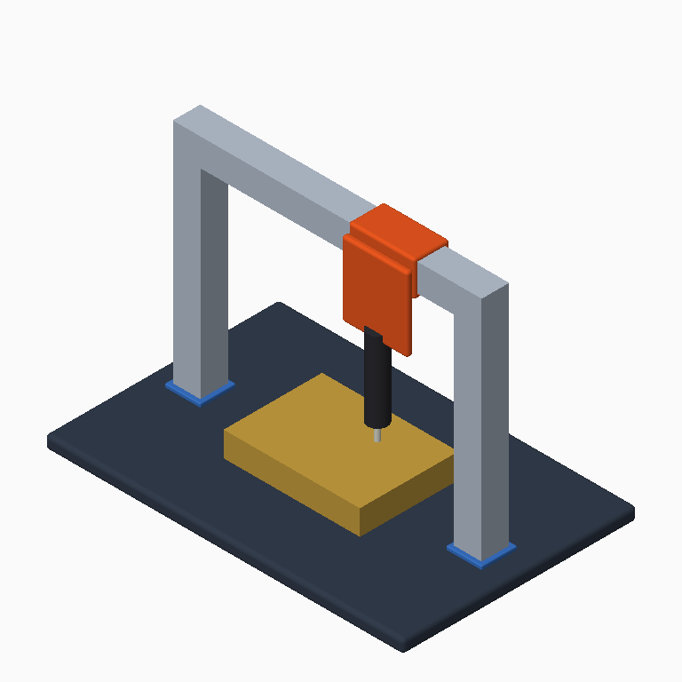
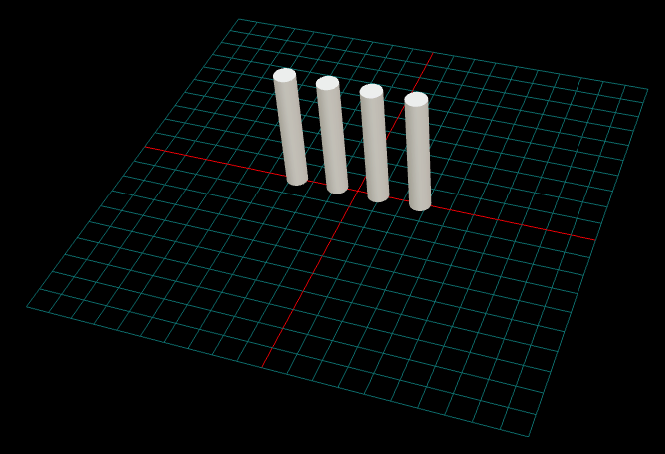
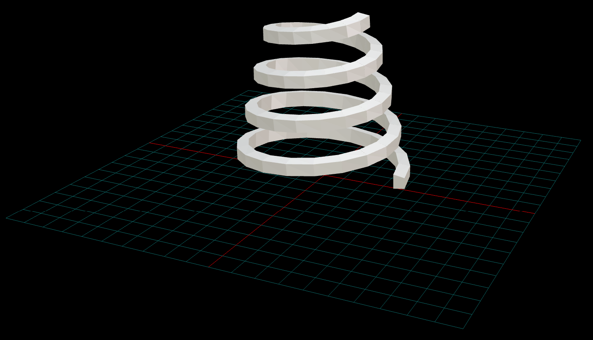
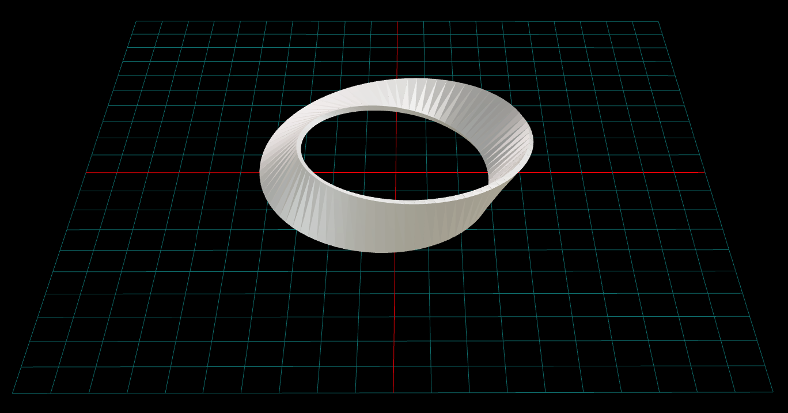
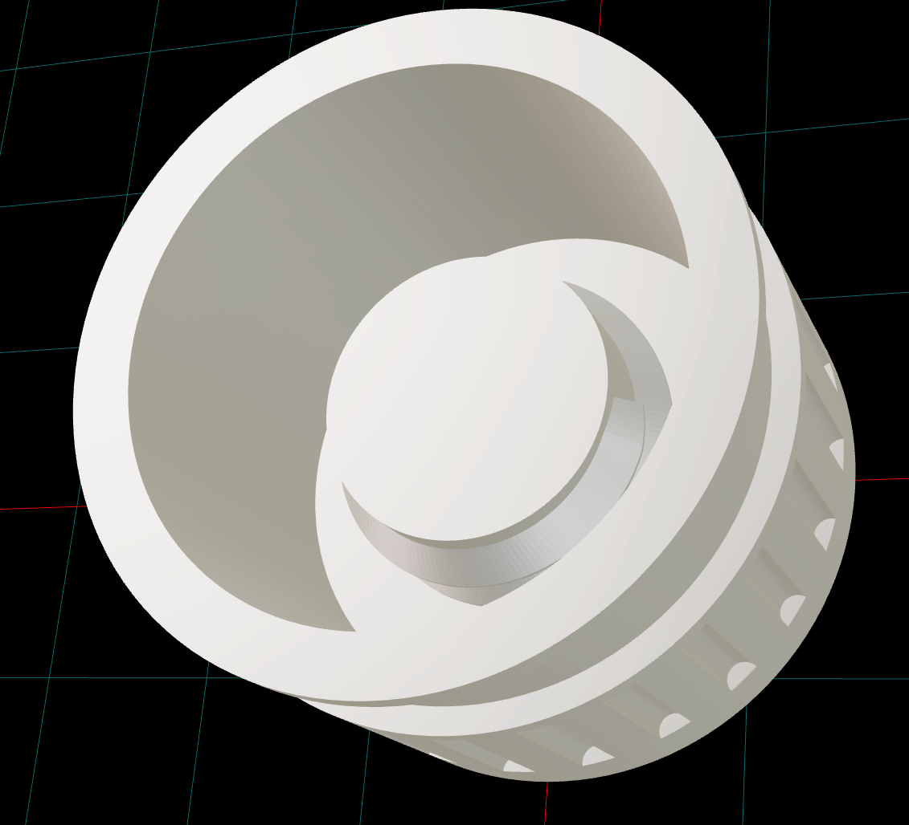
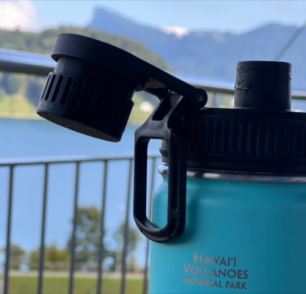
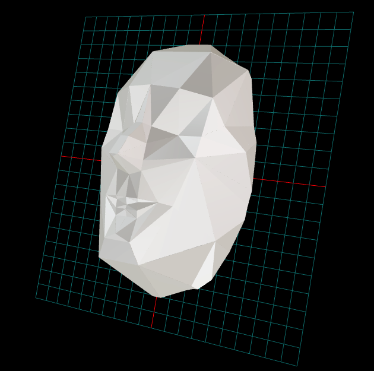

# 🚀 ShellForgePy Examples

This directory contains working examples of ShellForgePy geometry, assembly, and
production workflows. The examples generate inspectable 3D artifacts such as
STL, OBJ, and technical-drawing SVG files.

## 🎯 Quick Start

```bash
# Try the beginner-friendly example first
python examples/filleted_boxes_example.py

# Build a complete declarative machine scene
python examples/builder_machine_example.py
```

## 🏗️ Declarative Builder: Adaptive Inspection Gantry

**Problem:** a machine is not one part. It is a graph of reusable components,
interfaces, generated fit geometry, purchased references, and moving groups.
Writing every final XYZ coordinate into one Python script makes design changes
spread through the whole model.

[`builder_machine_example.py`](builder_machine_example.py) builds a compact
inspection gantry that demonstrates how the builder handles that system:

```text
shared dimensions
   ├── base + named upright pads
   ├── two instances of one structural-member resource
   └── bridge ──injected STEP geometry──> self-sizing tool carriage
                                             └── rigidly attached probe
                                                      │
                                      curated visualization scene
```



The preview is generated from the same cached assembly artifacts and placement
rules described below; it is not a separately maintained illustration.

```bash
python examples/builder_machine_example.py
```

**Output:**

- Colored assembly: `output/builder_machine_demo_runs/machine_demo_run_latest/machine_demo.obj`
- Isometric, front, and top PNG previews in the run's `previews/` directory
- Cached STEP artifacts for each assembly in `output/builder_machine_demo_repository/`
- A workflow manifest and placed-assembly bounding-box report

**What to look at:**

- [`assemblies.yaml`](builder_machine_demo/assemblies.yaml) is the readable
  product graph: parameters, dependencies, injections, and ordered placement.
- The small `*_generator.py` modules contain only local geometry that cannot be
  expressed as orchestration. Each resource has its own module, so editing the
  carriage does not invalidate the base or probe cache.
- `left_upright` and `right_upright` reuse one
  [`structural_member.yaml`](builder_machine_demo/structural_member.yaml)
  resource.
- The bridge solid is injected into `create_tool_carriage()`. The generator
  measures it and derives a matching opening plus running clearance, so changing
  `profile_size` does not require a second carriage edit.
- The uprights align to named base followers rather than copied coordinates.
  The probe is aligned to the carriage locally, attached with `rigid_group`,
  then moved with the carriage onto the bridge.
- [`machine_demo.yaml`](builder_machine_demo/machine_demo.yaml) is a collection
  root that chooses names, colors, and preview views without creating a
  redundant fused solid.

Try changing `profile_size`, `upright_height`, or `carriage_x_offset` in
`assemblies.yaml`, then run the command again. Only invalidated assemblies are
rebuilt; everything else is loaded from the content-addressed cache.

For the syntax behind the example, see the
[Declarative Builder Guide](../README_BUILDER.md).

## 📋 Available Examples

### 🔰 Beginner Examples

#### **Filleted Boxes** (`filleted_boxes_example.py`)
Parametric CAD modeling with selective edge filleting.

```bash
python examples/filleted_boxes_example.py
```

**Output:**
- Individual STL files: `filleted_boxes_example_*.stl`
- Combined layout: `filleted_boxes_example.stl`
- Process data: `filleted_boxes_example_process.json`

**Features:**
- 12 different fillet configurations
- Production-ready part arrangement
- Automatic build plate layout
- 3D printing process parameters

---

#### **Rotated Alignment** (`rotate_alignment_demo.py`)
Compact rotational topology with semantic alignments.

```bash
python examples/rotate_alignment_demo.py
```

**Output:**
- `output/rotate_alignment_demo.stl`
- `output/rotate_alignment_demo.obj`

**Features:**
- Builds one master-coordinate F marker from boxes
- Uses `for i in range(4)` and `i * 90` for the four corner systems
- Uses `rotate_alignment()` so the same stack-and-edge placement recipe works after every turn
- Avoids coordinate and sign math in the placement loop

---

#### **Complete Screw Assembly Board** (`complete_screw_assembly_board_demo.py`)
Mount complete screw assemblies into a thick board using semantic alignment.

```bash
python examples/complete_screw_assembly_board_demo.py
```

**Output:**
- `output/complete_screw_assembly_board_demo.obj`
- `output/complete_screw_assembly_board_demo.stl`

**Features:**
- Cylinder and conical heads in M3, M4, and M5 sizes
- Flush, proud, recessed, bottom-entry, and spaced-head mountings
- Access-hole and self-threading lead-in examples
- Alignment-only placement, with whole-assembly rotation for bottom entry
- Colored purchased-screw references alongside the cut board

---

#### **Cylinder Mesh** (`create_cylinder_stl.py`)
Basic mesh generation from point clouds.

```bash
python examples/create_cylinder_stl.py
```

**Output:**
- `output/cylinder_mesh.stl`

**Features:**
- Point cloud generation for cylinders
- Mesh triangulation and partitioning
- Multi-object positioning
- STL export



---

### 🔥 Path-Following Geometries

#### **Straight Snake** (`straight_snake.py`)
Simple straight channel with trapezoidal cross-section.

```bash
python examples/straight_snake.py
```

**Output:**
- `output/straight_snake.stl`

Perfect for LED strip channels or cable management.

---

#### **Curved Snake** (`curved_snake.py`)
Curved channel following a sine wave pattern.

```bash
python examples/curved_snake.py
```

**Output:**
- `output/curved_snake.stl`

Great for decorative elements or organic-shaped channels.

---

#### **Cylindrical Coil** (`cylindrical_coil.py`)
Helical coil with constant radius.

```bash
python examples/cylindrical_coil.py
```

**Output:**
- `output/cylindrical_coil.stl`

Perfect for LED strip coils or decorative spirals.

---

#### **Conical Coil** (`conical_coil.py`)
Advanced helical coil with varying radius.

```bash
python examples/conical_coil.py
```

**Output:**
- `output/conical_coil.stl`



Demonstrates advanced geometry impossible with traditional CAD!

---

#### **Möbius Strip** (`mobius_strip.py`)
Mathematical marvel - a surface with only one side!

```bash
python examples/mobius_strip.py
```

**Output:**
- `output/mobius_strip.stl`



The ultimate demonstration of coordinate transformation capabilities.

---

### 🧠 Advanced Examples

#### **M3 Tapped-Hole Technical Drawing** (`construction_drawing_m3_tapped_holes.py`)
Generate a supplier-style A4 SVG drawing from the same resolved CAD geometry
used to build the plate. The drawing demonstrates two blind M3 tap-drill holes,
two through M3 tap-drill holes, explicit outer dimensions, and exact
geometry-derived diameter callouts.

```bash
python examples/construction_drawing_m3_tapped_holes.py
```

**Output:**
- `output/construction_drawing_m3_tapped_holes/runs/m3_threaded_plate_run_latest/construction_drawings/m3_threaded_plate_top.svg`
- A workflow manifest beside the drawing, containing each annotation's target,
  measured value, units, and placed layout bounds

**What to look at:**
- Blind taps render `2 X M3 - 6H ↧ 6.00` above `⌀2.50 ±0.05`.
- Through taps render `2 X M3 - 6H THRU` above `⌀2.50`.
- `construction_drawing_m3_tapped_holes_demo/` is the complete builder
  resource, including named cutters and explicit annotation declarations.

---

#### **Hawaii Bottle Cap** (`bottle_cap_example.py`)
Real-world functional part with screw threads and grip textures.

```bash
python examples/bottle_cap_example.py
```

**Output:**
- `bottle_cap_example.stl`
- `bottle_cap_example_process.json`

**Features:**
- Precision screw thread generation (4.3mm pitch)
- 24 grip ripples around the circumference
- Multi-stage ring and cylinder construction
- Strategic geometry filleting for clean edges
- Production-ready 3D printing parameters
- Tested and validated with real bottle compatibility




Demonstrates advanced CAD adapter usage with complex alignments, boolean operations, and functional threading for real-world applications!

---

---

#### **Workflow & Slicer Integration** (`process_and_workflow.py`)
End-to-end example that pairs geometry generation with the workflow CLI and OrcaSlicer.

```bash
python examples/process_and_workflow.py
python src/shellforgepy/workflow/workflow.py run --slice examples/process_and_workflow.py
```

**Output:**
- Combined STL, process JSON, and OrcaSlicer assets in `runs/<script>_run_<timestamp>/`
- `plate_1.gcode` plus `<script>.3mf` generated by OrcaSlicer
- Optional mirrored STL copied to `viewer.default_stl_file` when configured

**Features:**
- Demonstrates the manifest produced by `arrange_and_export_parts`
- Shows how process overrides map into the example master settings directory
- Integrates with the workflow CLI described in [README_SLICER_INTEGRATION.md](../README_SLICER_INTEGRATION.md)

#### **M-Screws Production Assembly** (`m_screws_production_example.py`)
Comprehensive metric fastener library with dual assembly/production modes.

```bash
python examples/m_screws_production_example.py
```

**Output:**
- Individual STL files: `m_screws_production_example_*.stl`
- Combined layout: `m_screws_production_example.stl`
- 14 individual parts (screws, nuts, hex pieces, threaded components)

**Features:**
- Complete M2-M12 metric screw specifications (ISO standards)
- Dual mode operation:
  - `PRODUCTION=False`: Beautiful 3D assembly view with aligned components
  - `PRODUCTION=True`: Optimized 3D printing layout with proper part flipping
- Automatic screw head flipping for printable orientation
- 3D printing optimized nuts with configurable slack tolerances
- Threaded bolt and screw generation with minimal thread options
- Clearance hole diameter calculations (close/normal/loose fits)
- Smart production arrangement with centering and gap control

Perfect for creating custom fasteners, educational demonstrations, or rapid prototyping of mechanical assemblies!

---

#### **Face Mesh** (`create_face_stl.py`)
Complex organic shapes with mesh partitioning.

```bash
python examples/create_face_stl.py
```

**Output:**
- `face_stl_output/face_m_front.stl`
- `face_stl_output/face_m_back.stl`
- `face_stl_output/face_m_complete.stl`

**Features:**
- Organic shape point cloud generation
- Mesh partitioning (front/back splitting)
- Shell creation for hollow parts
- Multiple STL outputs for different regions



---

## 🎲 Run All Examples

Want to see everything in action?

### 🚀 **Quick Script (Recommended)**
```bash
# Run all examples with one command
./run_examples.sh
```

### 📋 **Individual Commands**
```bash
# Run each example individually
python examples/filleted_boxes_example.py
python examples/builder_machine_example.py
python examples/rotate_alignment_demo.py
python examples/complete_screw_assembly_board_demo.py
python examples/create_cylinder_stl.py
python examples/straight_snake.py
python examples/curved_snake.py
python examples/cylindrical_coil.py
python examples/conical_coil.py
python examples/mobius_strip.py
python examples/construction_drawing_m3_tapped_holes.py
python examples/bottle_cap_example.py
python examples/m_screws_production_example.py
python examples/process_and_workflow.py
python examples/create_face_stl.py
```

The `run_examples.sh` script provides:
- ✅ **Progress tracking** with clear success/failure indicators
- ✅ **Organized output** by example category (Beginner → Advanced)
- ✅ **Summary statistics** showing total passed/failed
- ✅ **Automatic error handling** - stops on first failure
- ✅ **CI/CD integration** - used in GitHub Actions workflow

## 📁 Output Files

Examples create STL files in these locations:
```
├── output/                          # Most examples
│   ├── cylinder_mesh.stl
│   ├── straight_snake.stl
│   ├── curved_snake.stl
│   ├── cylindrical_coil.stl
│   ├── conical_coil.stl
│   ├── mobius_strip.stl
│   ├── rotate_alignment_demo.stl
│   └── rotate_alignment_demo.obj
├── face_stl_output/                # Face example
│   ├── face_m_front.stl
│   ├── face_m_back.stl
│   └── face_m_complete.stl
├── bottle_cap_example.stl          # Bottle cap (current directory)
├── bottle_cap_example_process.json # Process parameters
├── m_screws_production_example_*.stl # M-screws fasteners (current directory)
├── m_screws_production_example.stl   # Combined m-screws assembly
└── filleted_boxes_example_*.stl    # Filleted boxes (current directory)
```

## 📊 Example Complexity

| Example | Complexity | Focus | Output Files |
|---------|------------|-------|--------------|
| `filleted_boxes_example.py` | 🔰 Beginner | CAD adapter usage, production workflow | 13 STL files |
| `rotate_alignment_demo.py` | 🔰 Beginner | Rotated semantic alignment placement | 2 files |
| `create_cylinder_stl.py` | 🔰 Beginner | Basic mesh workflows | 1 STL file |
| `straight_snake.py` | 🔰 Beginner | Path-following basics | 1 STL file |
| `curved_snake.py` | 🔶 Intermediate | Curved path following | 1 STL file |
| `cylindrical_coil.py` | 🔶 Intermediate | Helical geometries | 1 STL file |
| `conical_coil.py` | 🔶 Intermediate | Advanced helical paths | 1 STL file |
| `mobius_strip.py` | 🔶 Intermediate | Topological surfaces | 1 STL file |
| `builder_machine_example.py` | 🔶 Intermediate | Declarative multi-assembly builder | OBJ, previews, manifest |
| `complete_screw_assembly_board_demo.py` | 🔶 Intermediate | Semantic fastener mounting | STL and OBJ |
| `construction_drawing_m3_tapped_holes.py` | 🔴 Advanced | Explicit tapped-hole callouts | A4 SVG and manifest |
| `bottle_cap_example.py` | 🔴 Advanced | Functional parts, screw threads, production | 2 files |
| `m_screws_production_example.py` | 🔴 Advanced | Metric fasteners, dual-mode production | 15 files |
| `process_and_workflow.py` | 🔴 Advanced | Geometry → OrcaSlicer workflow integration | `runs/<script>_run_*` bundle |
| `create_face_stl.py` | 🔴 Advanced | Organic shapes, mesh partitioning | 3 STL files |

## 🛠️ Technologies Demonstrated

### Core Features:
- ✅ CAD adapter system (CadQuery/FreeCAD backend selection)
- ✅ Parametric solid modeling with filleted edges
- ✅ Precision screw thread generation with custom pitch
- ✅ Complete metric fastener library (M2-M12 ISO standards)
- ✅ Dual-mode production system (assembly view vs 3D printing layout)
- ✅ Advanced part arrangement with automatic flipping and rotation
- ✅ Point cloud generation for various geometries
- ✅ Mesh triangulation and conversion to printable meshes
- ✅ Mesh partitioning for multi-part printing
- ✅ Coordinate transformation for path-following geometries
- ✅ Production-ready part arrangement and export
- ✅ Semantic alignment rotation for compact corner/topology patterns
- ✅ Binary STL export

### Path-Following Capabilities:
- ✅ Following 3D curves with consistent cross-sections
- ✅ Surface normal direction control
- ✅ Multi-segment assembly and connection
- ✅ Loop closure with vertex correspondence detection
- ✅ Mathematical surface generation (Möbius strips)

## 🎯 Applications

These examples are perfect for:

- **LED strip channels and mounting systems**
- **Cable management and wire routing**
- **Decorative moldings and trim pieces**
- **Custom coils and spiral structures**
- **Functional parts with screw threads (bottle caps, lids, containers)**
- **Metric fasteners and mechanical hardware (bolts, nuts, screws)**
- **Rapid prototyping of mechanical assemblies**
- **Mathematical models and educational demonstrations**
- **3D printing projects with optimized part orientation**

## 🖨️ 3D Printing Ready

All examples generate STL files optimized for 3D printing:

- ✅ Dimensions in millimeters
- ✅ Appropriate wall thickness for FDM/SLA printing
- ✅ Manifold meshes (watertight geometry)
- ✅ Optimized triangle counts

## 🚀 Next Steps

1. **Try all examples at once** with `./run_examples.sh`
2. **Start with `filleted_boxes_example.py`** for CAD adapter basics
3. **Try `rotate_alignment_demo.py`** for alignment-first corner placement
4. **Try `create_cylinder_stl.py`** for mesh fundamentals
5. **Explore path-following** with snake and coil examples
6. **Build functional parts** with the bottle cap example
7. **Challenge yourself** with the advanced face mesh example
8. **Modify the examples** for your own projects!

---

Ready to create amazing 3D geometries? Pick an example and start building! 🎯
